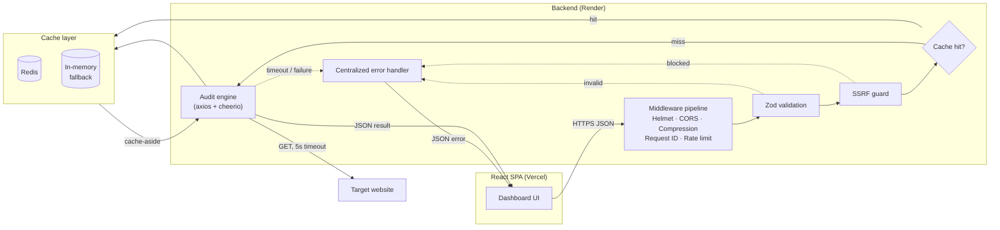
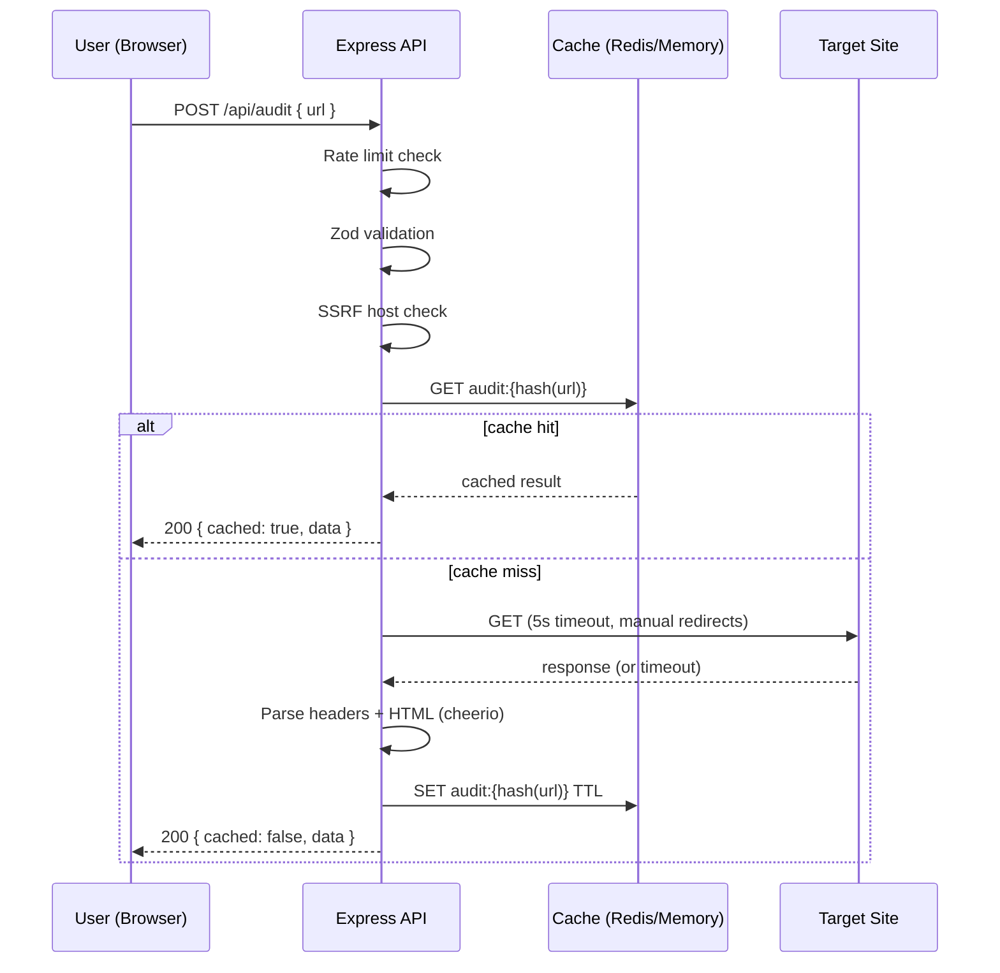
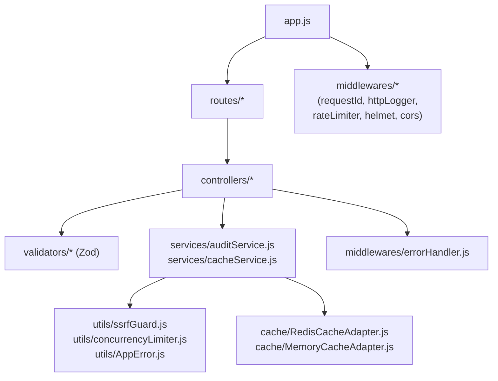

# Page Pulse

**Production-grade URL audit service.** Submit any public URL and get back status, security posture, SEO signals, and response health — in one API call, in under five seconds.

Built for the Digital Heroes Software Development (SDE) Qualification Task.


---

## Table of contents

- [What it does](#what-it-does)
- [Architecture](#architecture)
- [Tech stack](#tech-stack)
- [Folder structure](#folder-structure)
- [Getting started](#getting-started)
- [Environment variables](#environment-variables)
- [API contract](#api-contract)
- [Caching](#caching)
- [Rate limiting](#rate-limiting)
- [Security](#security)
- [Testing](#testing)
- [Deployment](#deployment)
- [Observability](#observability)
- [Screenshots](#screenshots)
- [Future improvements](#future-improvements)

---

## What it does

`POST /api/audit` with a URL and Page Pulse will:

1. Validate the URL shape (Zod) and reject anything that isn't `http`/`https`.
2. Block requests to localhost, private IP ranges, and link-local addresses (SSRF protection) — checked on the initial host **and every redirect hop**.
3. Fetch the page with a hard 5-second timeout and a bounded redirect chain.
4. Parse and return: status code, HTTPS status, redirect count, response time, content type/length, server header, cache-control, HSTS, a curated set of security headers, and on-page SEO signals (title, meta description, canonical URL, Open Graph tags, robots meta, favicon).
5. Cache the result (Redis, or an in-memory fallback) so repeat requests for the same URL within the TTL window don't re-fetch.

## Architecture



### Request sequence



### Component diagram



## Tech stack

| Layer | Choice |
|---|---|
| Frontend | React 19, Vite, Tailwind CSS, Axios, React Router |
| Backend | Node.js, Express.js |
| HTML parsing | Cheerio |
| Caching | Redis (ioredis) with an in-memory fallback adapter |
| Validation | Zod |
| Logging | Pino + pino-http, correlation IDs |
| Rate limiting | express-rate-limit |
| Security | Helmet, CORS, compression, SSRF guard |
| Testing | Jest, Supertest, nock |
| CI/CD | GitHub Actions |
| Deployment | Frontend → Vercel, Backend → Render |

See [`docs/technology-decisions.md`](docs/technology-decisions.md) for why each was chosen and what was rejected.

## Folder structure

```
page-pulse/
├── client/                  # React + Vite dashboard
│   └── src/
│       ├── api/              # Axios client
│       ├── components/       # NavBar, Footer, AuditResultCard, PulseMonitor, etc.
│       ├── context/           # Toast notifications
│       ├── hooks/             # useAuditHistory (localStorage)
│       ├── pages/             # Home, AuditResult, History, NotFound
│       └── utils/             # Formatting helpers
├── server/                  # Express API
│   └── src/
│       ├── config/            # env.js, logger.js
│       ├── controllers/       # auditController, healthController
│       ├── routes/            # auditRoutes, healthRoutes
│       ├── services/          # auditService (core engine), cacheService
│       ├── middlewares/       # requestId, httpLogger, errorHandler, rateLimiter, validate
│       ├── validators/        # Zod schemas
│       ├── cache/              # Redis + Memory adapters, factory
│       └── utils/              # AppError hierarchy, ssrfGuard, concurrencyLimiter
│   └── tests/
│       ├── unit/
│       └── integration/
├── docs/                     # Architecture, TDR, failure analysis, observability, rollback
├── .github/workflows/ci.yml
└── render.yaml
```

## Getting started

### Prerequisites
- Node.js 18+
- (Optional) a local Redis instance — the server falls back to an in-memory cache adapter if `REDIS_URL` is unset

### Backend

```bash
cd server
cp .env.example .env
npm install
npm run dev        # starts on http://localhost:5000
```

### Frontend

```bash
cd client
cp .env.example .env
npm install
npm run dev         # starts on http://localhost:5173
```

Open `http://localhost:5173` and audit a URL.

## Environment variables

### Server (`server/.env`)

| Variable | Default | Description |
|---|---|---|
| `NODE_ENV` | `development` | `development` \| `production` \| `test` |
| `PORT` | `5000` | HTTP port |
| `CORS_ORIGIN` | `http://localhost:5173` | Comma-separated allowed origins |
| `REDIS_URL` | _(empty)_ | Redis connection string; blank = in-memory cache |
| `CACHE_TTL_SECONDS` | `300` | How long a cached audit result is valid |
| `RATE_LIMIT_WINDOW_MS` | `60000` | Rate limit window |
| `RATE_LIMIT_MAX` | `20` | Max requests per IP per window |
| `AUDIT_TIMEOUT_MS` | `5000` | Hard timeout per outbound fetch |
| `AUDIT_MAX_CONCURRENCY` | `10` | Max simultaneous outbound audits |
| `AUDIT_MAX_REDIRECTS` | `5` | Max redirect hops followed |
| `LOG_LEVEL` | `info` | Pino log level |

### Client (`client/.env`)

| Variable | Default | Description |
|---|---|---|
| `VITE_API_BASE_URL` | `http://localhost:5000/api` | Backend API base URL |

## API contract

### `POST /api/audit`

**Request**
```json
{ "url": "https://example.com" }
```

**Success response — `200`**
```json
{
  "success": true,
  "cached": false,
  "requestId": "707478be-0157-4d23-bea6-1aa19a6b5d70",
  "data": {
    "requestedUrl": "https://example.com",
    "finalUrl": "https://example.com",
    "statusCode": 200,
    "https": true,
    "redirectCount": 0,
    "responseTimeMs": 84,
    "contentType": "text/html; charset=utf-8",
    "contentLength": 1256,
    "serverHeader": "ECS",
    "cacheControl": "max-age=604800",
    "hsts": "max-age=63072000",
    "securityHeaders": { "strict-transport-security": "max-age=63072000" },
    "seo": {
      "title": "Example Domain",
      "metaDescription": "...",
      "canonicalUrl": "https://example.com/",
      "openGraph": { "title": "...", "description": "..." },
      "robotsMeta": "index, follow",
      "favicon": "https://example.com/favicon.ico"
    },
    "auditedAt": "2026-07-25T13:41:56.303Z"
  }
}
```

### `GET /api/health`
Returns process uptime, cache adapter status, and current audit concurrency — used by Render's health check and any uptime monitor.

### Error responses

Every error, from every layer, returns the same shape:

```json
{
  "success": false,
  "message": "Request validation failed",
  "errorCode": "VALIDATION_ERROR",
  "requestId": "0148a9cf-6019-4733-a547-b56c615c934c",
  "details": [{ "path": "url", "message": "url must be a valid absolute http(s) URL" }]
}
```

| Status | `errorCode` | When |
|---|---|---|
| 400 | `VALIDATION_ERROR` | Malformed or missing URL |
| 403 | `FORBIDDEN` | Target resolves to localhost/private IP (SSRF guard) |
| 404 | `ROUTE_NOT_FOUND` | Unknown route |
| 408 | `REQUEST_TIMEOUT` | Target didn't respond within `AUDIT_TIMEOUT_MS` |
| 429 | `RATE_LIMIT_EXCEEDED` | Too many requests from this IP |
| 500 | `INTERNAL_SERVER_ERROR` | Unexpected failure |

## Caching

Cache-aside pattern, keyed by `sha256(normalized url)`. Same URL within `CACHE_TTL_SECONDS` returns the stored result without a new fetch. Redis is used when `REDIS_URL` is set; otherwise an in-memory `Map`-based adapter takes over transparently — same interface, zero code changes required elsewhere. See [`docs/failure-analysis.md`](docs/failure-analysis.md) for what happens if Redis goes down mid-request.

## Rate limiting

20 requests/minute per IP by default (configurable). Limit responses use the same JSON error contract as every other error in the system.

## Security

- **Helmet** — sensible security headers by default
- **CORS** — locked to `CORS_ORIGIN`
- **Compression** — gzip responses
- **Input validation** — Zod schema, protocol allowlist (`http`/`https` only)
- **SSRF guard** — blocks localhost, `10.0.0.0/8`, `172.16.0.0/12`, `192.168.0.0/16`, link-local, and IPv6 equivalents, re-checked on every redirect hop
- **Body size limit** — 100kb JSON body cap

## Testing

```bash
cd server
npm test
```

51 tests (Jest + Supertest + nock) covering validation, SSRF blocking, cache hit/miss, redirect handling, timeouts, rate limiting, the centralized error handler, and the health endpoint. Coverage gate: 80% lines/functions, 75% branches (actual: ~93% lines, ~93% functions on the last run).

## Deployment

**Frontend → Vercel**: import the `client/` directory as the project root, set `VITE_API_BASE_URL` to your Render backend URL. `client/vercel.json` handles the SPA rewrite.

**Backend → Render**: `render.yaml` at the repo root defines the web service (and an optional managed Redis instance). Render auto-detects it via "New → Blueprint", or configure manually with root directory `server`, build command `npm ci`, start command `npm start`, health check path `/api/health`.

See [`docs/rollback-plan.md`](docs/rollback-plan.md) for what to do if a deploy goes bad.

## Observability

Structured JSON logs (Pino) with a correlation ID on every request, propagated via the `X-Request-Id` header. `/api/health` reports cache health and current audit concurrency. Full detail — including what a production setup would add (metrics, tracing, alerting) — is in [`docs/observability.md`](docs/observability.md).

## Screenshots

> _Add screenshots here after your first local run:_
> - `docs/screenshots/home.png` — landing + audit form
> - `docs/screenshots/result.png` — full audit result card
> - `docs/screenshots/history.png` — search + history list

## Future improvements

- Persist history server-side (per-user, not just localStorage) once auth is introduced
- Lighthouse-style performance scoring (LCP/CLS proxies) alongside the current header/SEO audit
- Webhook/scheduled re-audits for a saved list of URLs
- OpenAPI/Swagger spec generated from the Zod schemas
- Multi-region deployment with a shared Redis for true horizontal scaling

---

Built for [Digital Heroes Training Task](https://digitalheroesco.com).
